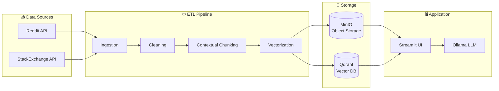

# 🤖 QA-Data-Pipeline-RAG-LLM

> **Intelligent Question-Answering Platform powered by RAG (Retrieval-Augmented Generation) and LLM**

A complete data pipeline solution to build a Q&A system fueled by data from **Reddit** and **StackExchange**, using vector embeddings and local language models via **Ollama**.

---

## 📋 Table of Contents

- [Overview](#-overview)
- [Architecture](#-architecture)
- [Tech Stack](#-tech-stack)
- [Prerequisites](#-prerequisites)
- [Installation](#-installation)
- [Configuration](#-configuration)
- [Usage](#-usage)
- [Project Structure](#-project-structure)
- [Data Pipeline](#-data-pipeline)
- [User Interface](#-user-interface)
- [Contributors](#-contributors)

---

## 🎯 Overview

This project implements a **Question-Answering (QA)** platform that:

1. **Ingests data** from Reddit and StackExchange
2. **Cleans and processes** posts and comments
3. **Creates vector embeddings** for semantic search
4. **Uses a local LLM** (via Ollama) to generate contextual answers
5. **Provides an intuitive web interface** via Streamlit

---

## 🏗 Architecture



---

## 🛠 Tech Stack

| Component | Technology | Description |
|-----------|------------|-------------|
| **LLM** | Ollama (Llama 3.2) | Local language model |
| **Embeddings** | Sentence-Transformers | `all-MiniLM-L6-v2` for vectorization |
| **Vector Database** | Qdrant | Vector storage and search |
| **Object Storage** | MinIO | CSV file storage |
| **Big Data Processing** | Apache Spark | Distributed processing (optional) |
| **Web Interface** | Streamlit | Interactive user interface |
| **Containerization** | Docker | Simplified deployment |

---

## 📦 Prerequisites

- **Python** 3.9+
- **Docker** and **Docker Compose**
- **Ollama** installed locally with a model (e.g., `llama3.2`)
- API accounts for:
  - Reddit (PRAW credentials)
  - StackExchange (API key)

---

## 🚀 Installation

### 1. Clone the repository

```bash
git clone https://github.com/Ibral100/QA-Data-Pipeline-RAG-LLM.git
cd QA-Data-Pipeline-RAG-LLM
```

### 2. Start Docker services

```bash
docker-compose up -d
```

This starts:
- **MinIO** → `http://localhost:9000` (Console: `http://localhost:9001`)
- **Qdrant** → `http://localhost:6333`
- **Spark Master** → `http://localhost:8080`
- **Spark Workers** (x2)

### 3. Install Python dependencies

```bash
pip install -r requirements.txt
```

### 4. Install Ollama and download a model

```bash
# Install Ollama (see https://ollama.ai)
ollama pull llama3.2
```

---

## ⚙️ Configuration

### Reddit Configuration (`config_Api_Reddit.py`)

```python
reddit = praw.Reddit(
    client_id='YOUR_CLIENT_ID',
    client_secret='YOUR_CLIENT_SECRET',
    username='YOUR_USERNAME',
    password='YOUR_PASSWORD',
    user_agent='YourApp/0.1'
)
```

### MinIO Configuration (`config_miniO.py`)

```python
client = Minio(
    "localhost:9000",
    access_key="admin",
    secret_key="12345678",
    secure=False
)
```

### Theme Configuration (`config_source_dest.py`)

```python
theme_source = "askhistorians"  # Source subreddit or StackExchange site
theme_dest = "history"          # Destination folder name
```

---

## 📖 Usage

### Step 1: Data Ingestion

**Reddit:**
```bash
python REDDIT-Ingestion.py
```

**StackExchange:**
```bash
python STACK-Ingestion.py
```

### Step 2: Data Cleaning

```bash
# Reddit
python REDDIT-Nettoyage-Posts.py
python REDDIT-Nettoyage-Comms.py

# StackExchange
python STACK-Nettoyage-Posts.py
python STACK-Nettoyage-Comms.py
```

### Step 3: Joining and Merging

```bash
python REDDIT-jointure.py
python STACK-jointure.py
python PLATFORM-Merge.py
```

### Step 4: Contextual Chunking

```bash
python PLATFORM-contextual-Chunking.py
```

### Step 5: Launch the Application

```bash
streamlit run app.py
```

The application will be available at `http://localhost:8501`

---

## 📁 Project Structure

```
QA-Data-Pipeline-RAG-LLM/
│
├── 📥 Ingestion
│   ├── REDDIT-Ingestion.py       # Collect Reddit posts/comments
│   └── STACK-Ingestion.py        # Collect StackExchange questions/answers
│
├── 🧹 Cleaning
│   ├── REDDIT-Nettoyage-Posts.py # Clean Reddit posts
│   ├── REDDIT-Nettoyage-Comms.py # Clean Reddit comments
│   ├── STACK-Nettoyage-Posts.py  # Clean StackExchange questions
│   └── STACK-Nettoyage-Comms.py  # Clean StackExchange answers
│
├── 🔗 Transformation
│   ├── REDDIT-jointure.py        # Join Reddit posts-comments
│   ├── STACK-jointure.py         # Join StackExchange questions-answers
│   ├── PLATFORM-Merge.py         # Merge both platforms
│   └── PLATFORM-contextual-Chunking.py  # Chunking and vectorization
│
├── 🖥️ Application
│   ├── app.py                    # Main Streamlit application
│   ├── app2.py                   # Alternative version
│   └── PLATFORM-GenerationLLM.py # LLM generation script
│
├── ⚙️ Configuration
│   ├── config_Api_Reddit.py      # Reddit credentials
│   ├── config_miniO.py           # MinIO configuration
│   └── config_source_dest.py     # Source/destination parameters
│
├── 🐳 Docker
│   ├── docker-compose.yml        # Service orchestration
│   └── Dockerfile-spark          # Custom Spark image
│
├── 📦 Other
│   ├── main-local.py             # Local execution
│   ├── main-spark.py             # Spark execution
│   └── requirements.txt          # Python dependencies
│
└── README.md
```

---

## 🔄 Data Pipeline

### 1. Ingestion
- Collects posts/questions and their comments/answers
- Filters deleted or moderated content
- Respects API rate limits

### 2. Cleaning
- Removes special characters
- Normalizes text
- Filters empty content

### 3. Contextual Chunking
- Intelligent content segmentation
- Manages dependencies between posts and comments

### 4. Vectorization
- Creates embeddings with `sentence-transformers/all-MiniLM-L6-v2`
- Indexes in Qdrant for semantic search

### 5. RAG Generation
- Searches for similar documents via Qdrant
- Augments context with associated comments
- Generates response via Ollama (Llama 3.2)

